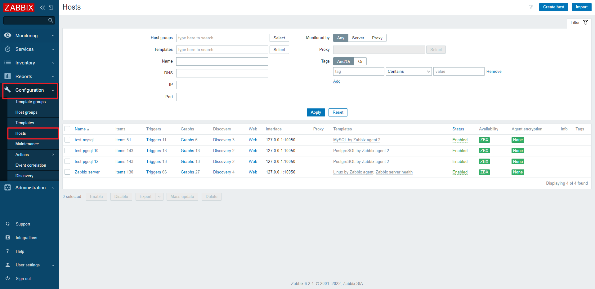
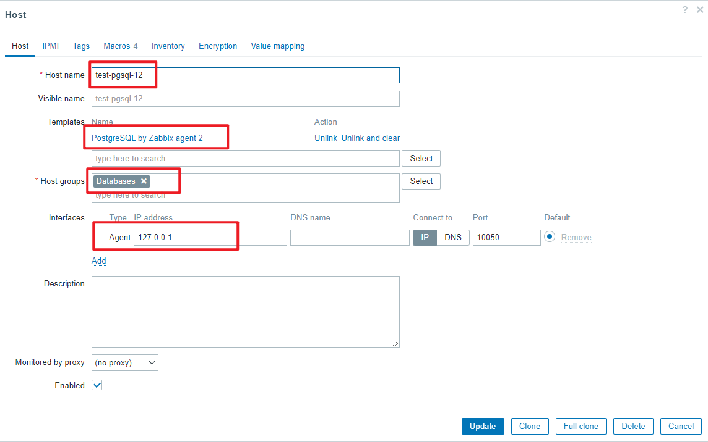
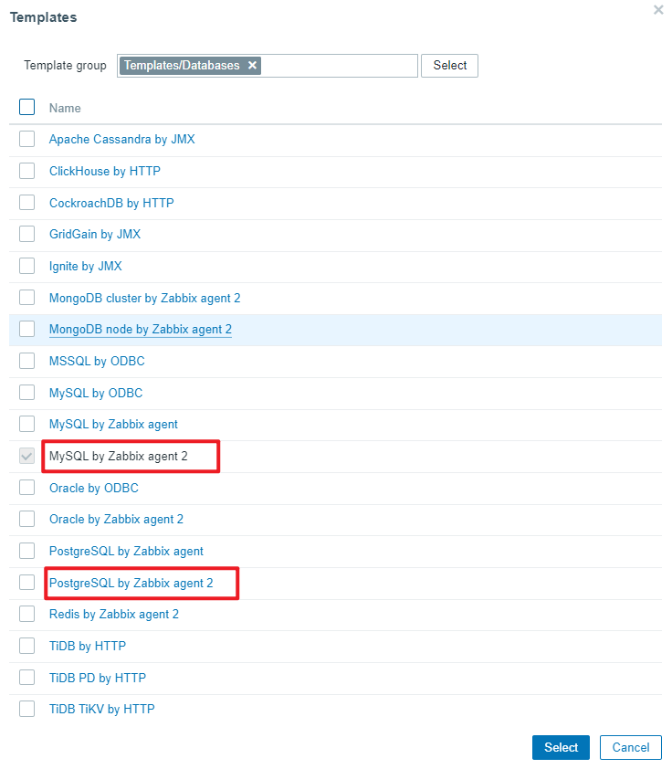
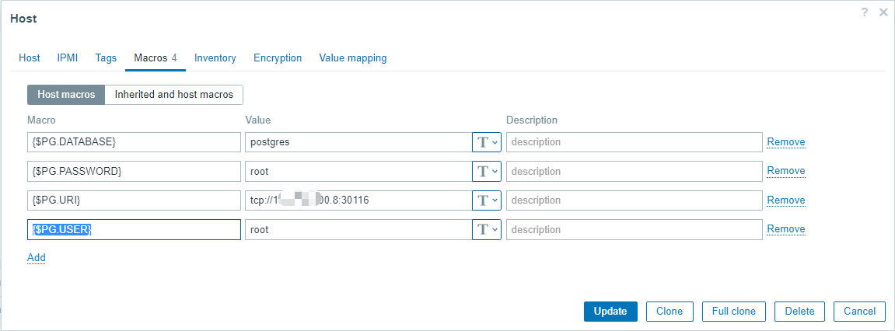
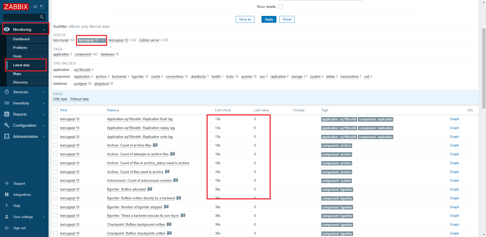

# deploy zabbix
[deploy zabbix](deploy_zabbix.md)

# zabbix dashboard
ip:8080 or ip:80/zabbix

user: Admin(admin)/zabbix

# zabbix usage

1. login web page
2. add host(Configuration/Hosts)


- a. set Host


> MySQL template: MySQL by Zabbix agent 2
> 
> PostgreSQL template: PostgreSQL by Zabbix agent 2



- b. set Macros var

MySQL set：{$MYSQL.DSN} {$MYSQL.PASSWORD} {$MYSQL.USER}
PostgreSQL set: {$PG.DATABASE} {$PG.PASSWORD} {$PG.URI} {$PG.USER}



3. test data(Monitoring/Latest data)



xxx. add test data
```bash
pgbench -i -s 100 -U postgres test
pgbench -P 1 -c 32 -j 4 -T 300 -U postgres test
```


# others

### 1、 create.sql
`create.sql` file from zabbix-server-pgsql container, /usr/share/doc/zabbix-server-pgsql/create.sql.gz file
